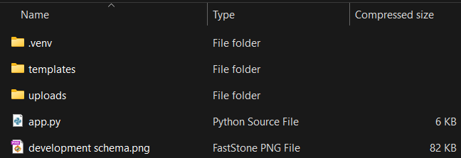
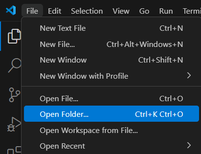
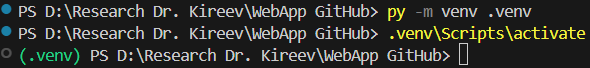
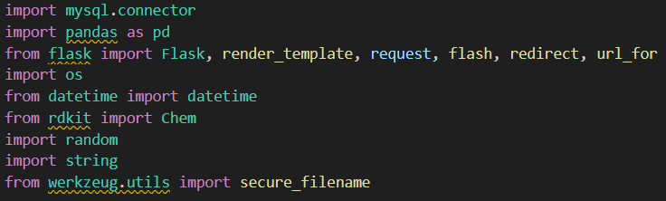
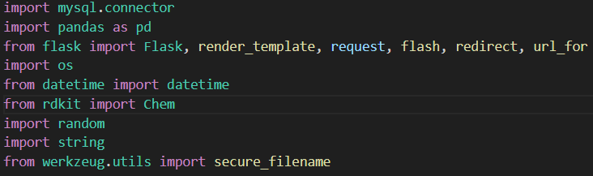
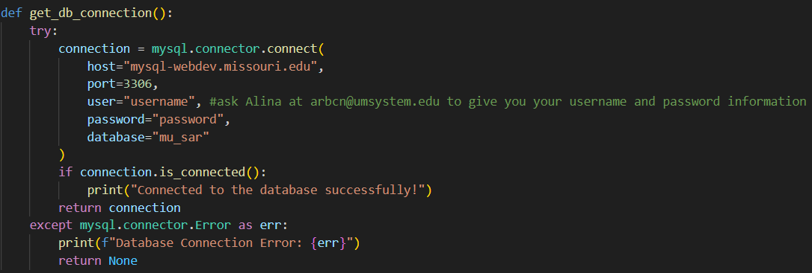
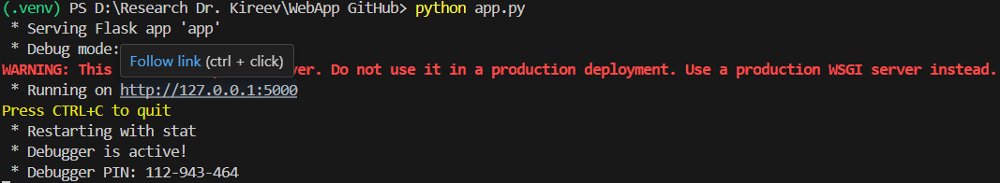
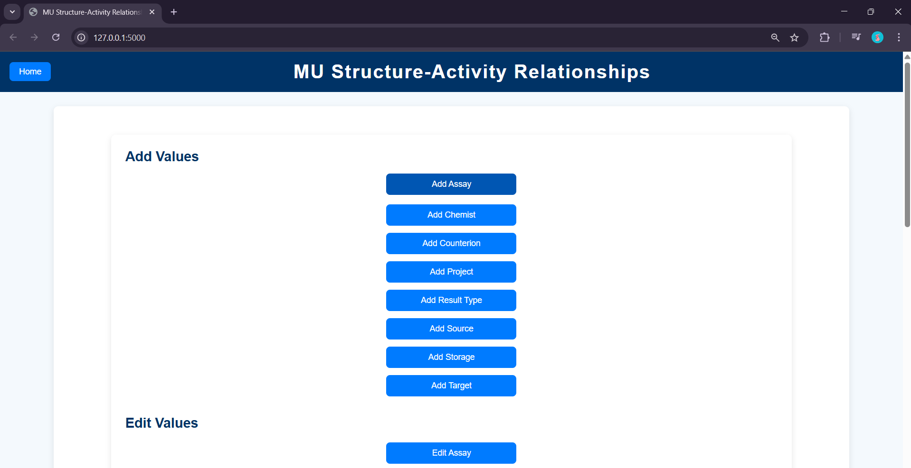

# Adding new data into MU SAR databse for Dr. Kireev's lab
MU SAR - University of Missouri Structure–Activity Relationship

This project explains how to run a web application on a local machine using Visual Studio Code to populate MU SAR database for Dr. Kireev's lab.

## Step 1: Download file "WebApp GitHub.zip" and extract all files. 


## Step 2: Open folder with exctracted files in Visual Studio Code.


## Step 3: In terminal in Visual Studio type commands:

```
py -m venv .venv

.venv\Scripts\activate
```



## Step 4: Download neccessary libraries in the activated previously environment.
Currently several libraries are underlined:


One by one type next commands into terminal in Visual Studio:

```
pip install mysql-connector-python
pip install pandas
pip install flask
pip install rdkit
```

These commands should install neccessary libraries and remove lines under their names: 


## Step 5: Run web application
To connect to the database by using app.py, you need to enter your username and password for the database in this part of the code:

All passwords were assigned by IT department to members of Dr. Kireev's lab and you need to reach out to Alina at arbcn@umsystem.edu to receive them.

Run this command in Visual Studio terminal:

```python app.py```

Press CTRL + click on the http:// link


## Step 6: Add, update, or remove data using the web application


